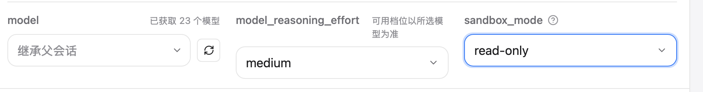

平台: Claude

本次开发任务集中于优化codex侧,暂无需考虑claude和cursor的兼容性问题
1. docs/official/003-codex-cli-docs.md 把该文档里的Subagent example都加入我们的内置模板,当前的内置模板全部删除
2. 我觉得现在的新增自定义子代理太复杂了,使用门槛太高,我想让你最大程度简化一下,具体的说,我觉得配置页只需要加子代理名称(对应name), 描述(对应description), 模型(对应model,这里我想说一点,我希望用户能在下拉表里面选当前的GPT模型,而不用自己手打,具体的说,可以参考cc-switch在这方面的处理),思考强度(对应model_reasoning_effort,注意部分模型比如gpt-5.6-sol除了low, medium, high, xhigh, max等,这点希望你可以查验openai的官方文档),沙盒模式(对应sandbox_mode), 遵循指令(对应developer_instructions),然后我希望在沙盒模式,遵循指令这两项比较抽象的选单旁边可以加一个问号按钮,鼠标放上去可以显示一些这两项的说明,除此之外关于默认项,名称,描述,模型,遵循指令这几项默认为空,思考强度默认medium,沙盒模式默认read-only,另外关于模型我希望能缓存通过/v1接口获取到的模型列表,下次用户就不用重新下载了,除此之外配置页面的目标平台与高级字段和保存为个人模板应当保留不做修改

1. 我想要一个模型的下拉选单,现在确实可以拉取模型了,但是并不能下拉选单
2. 并不是所有的模型都有max和ultra两个等级,希望只在支持的模型上面加上(初步只针对于gpt系列模型做适配)
3. 选模型的下拉表我觉得现在有点丑,能不能学学cc-switch那个表单
4. 现在新增模型的名称, 描述挤在一行,感觉特别不整齐,要不然各自都独占一行吧
5. 现在我把diy-subagent切到新增自定义模型页面,然后前台切到另一个app再切回diy-subagent的时候就会白屏然后退回到首页,这是pnpm tauri:dev的原因吗?正式版release会不会有这个情况

前端有点问题,怎么model和model_reasoning_effort,sandbox_mode不在一行了,而且这部分能改成我先前说的中文吗